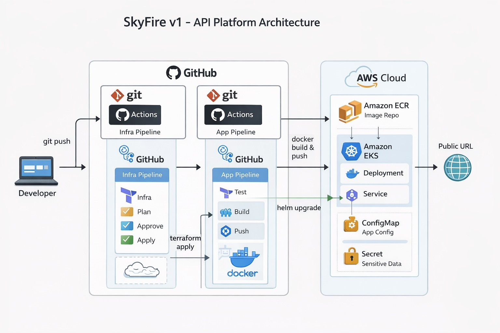

# SkyFire

Production-style cloud-native application deployed on AWS EKS with CI/CD, containerization, and secure HTTPS exposure via ALB.

## 🌐 Live Demo
https://skyfire.fabdev.co

- HTTPS secured via AWS ACM
- Exposed through AWS Application Load Balancer (ALB)
- Running on Kubernetes (EKS)

## Tech Stack

- **Cloud:** AWS (EKS, ALB, ACM, ECR)
- **Containerization:** Docker
- **Orchestration:** Kubernetes (EKS)
- **Infrastructure as Code:** Terraform
- **CI/CD:** GitHub Actions
- **Deployment:** Helm
- **Application:** FastAPI (Python)

## How It Works

1. Developer pushes code to GitHub
2. CI pipeline builds Docker image and pushes to Amazon ECR
3. Kubernetes (EKS) pulls the image and deploys pods
4. Service exposes the application internally
5. AWS ALB Ingress routes external traffic to the service
6. HTTPS is terminated at ALB using AWS ACM certificate
7. HTTP traffic is automatically redirected to HTTPS

## Key Features

- Public HTTPS endpoint with custom domain
- Kubernetes deployment with readiness & liveness probes
- ALB Ingress with SSL termination
- HTTP → HTTPS redirect enforced
- Containerized FastAPI application

## Architecture Diagram

SkyFire v1 follows a production-style DevOps pipeline:

This diagram shows the full CI/CD lifecycle, from a developer git push to automated build, containerization, and deployment on AWS EKS.

## Purpose

SkyFire v1 is a cloud-native DevOps project designed to simulate how modern applications are deployed in production environments.

The focus of this project is not on application complexity, but on:
- Infrastructure design
- Automation
- CI/CD pipelines
- Secure and scalable deployment on AWS

This project reflects a hands-on approach to learning by building, debugging, and operating real systems using industry-standard tools.

## Challenges & Lessons Learned

- Resolved Docker image architecture mismatch (ARM vs AMD64) when deploying from Apple Silicon to EKS
- Debugged ImagePullBackOff errors caused by incorrect image builds
- Configured AWS ALB Ingress Controller with proper annotations for HTTPS and SSL termination
- Implemented ACM certificate validation and DNS configuration for custom domain
- Understood traffic flow from DNS → ALB → Ingress → Service → Pod